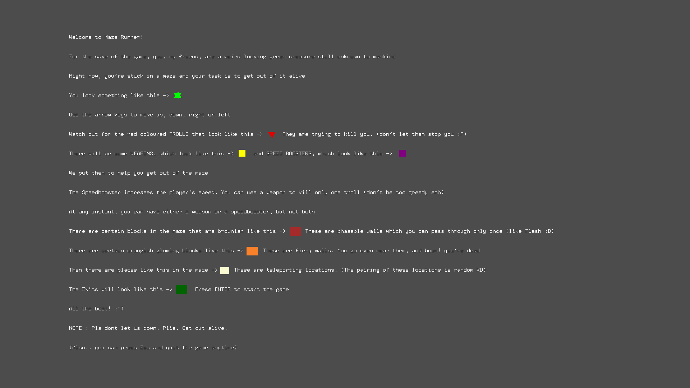

# Maze Runner
A popular maze runner game implemented in C++ using OpenGL, as a part of IEEE-NITK Envision 2019.


## Installation

For Ubuntu/Debian:

Install OpenGL libraries:

```
sudo apt-get install mesa-utils
```

Install freeGlut:

```
sudo apt-get install freeglut3-dev
```

Please refer to [this](https://www.khronos.org/opengl/wiki/Getting_Started) to install the necessary libraries in Windows and macOS.


## How to run

Compile the game with the following command :

```
g++ game.cpp -lglut -lGL -lGLU -o game

./game
```

## Demo

### Instructions

<div></div>


### Game Play

<p align="center"></p>
